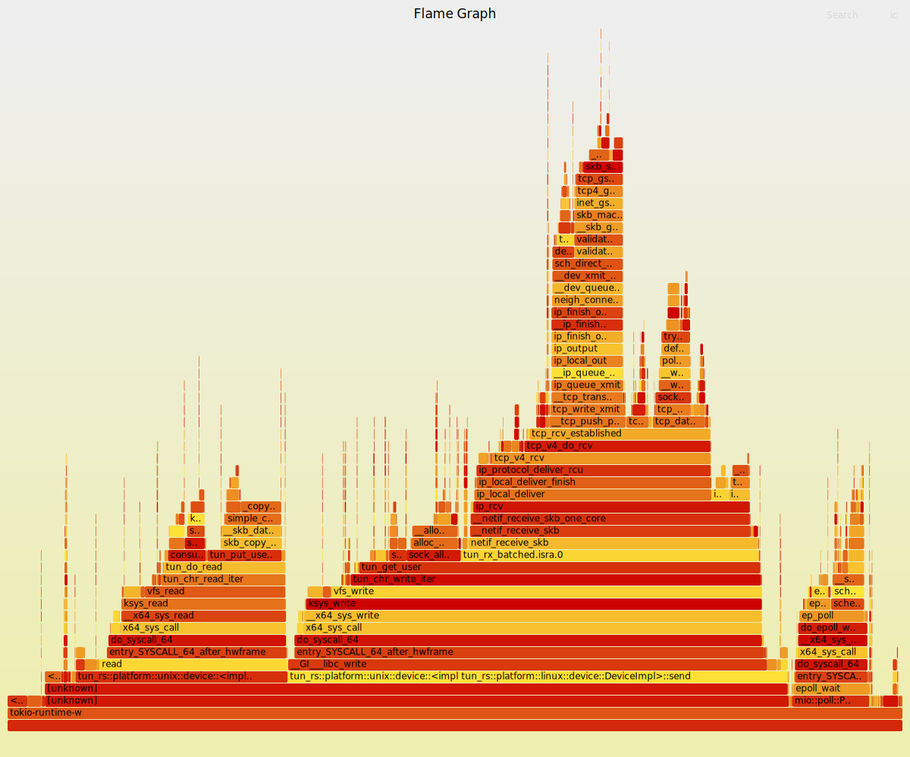
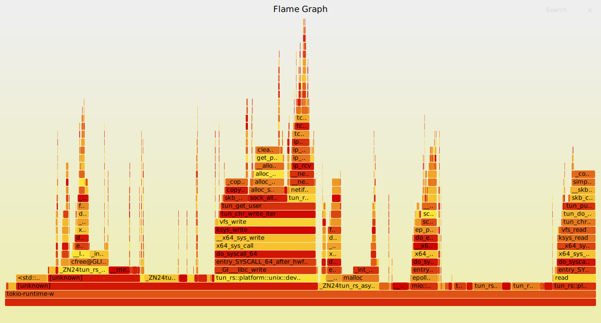
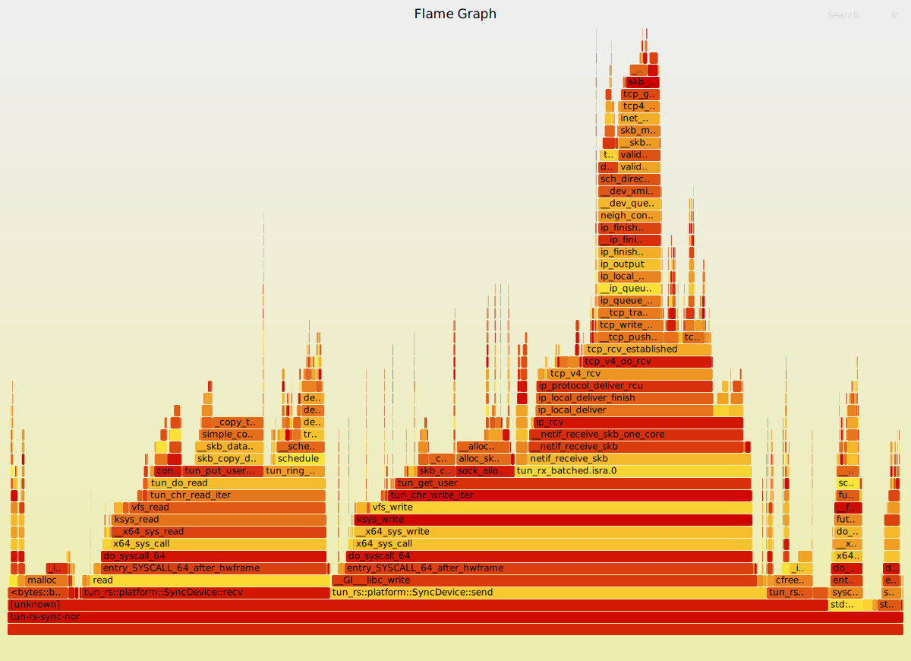

# TUN Benchmark Tool

This is a benchmarking tool for measuring the performance of TUN interface implementations on Linux using different
configurations and libraries.

## Environment

- **OS:** WSL(Ubuntu 20.04.6 LTS)
- **CPU:** i7-13700F
- **Benchmark Tool:** iperf3
- **Baseline Performance (Loopback via TUN IP):** ~162 Gbps
- **TUN Libraries:** [`tun-rs`](https://github.com/tun-rs/tun-rs)

## Test

Each test uses `iperf3` to send traffic from `10.0.1.1` (via `tun11`) to `10.0.2.1` (via `tun22`). All interfaces are
handled using a Rust-based TUN forwarder, either in async or sync mode, with optional channel buffering and offload.

```shell
 # Test all test cases
 ./scripts/bench.sh
 # Run the specified test case with parameters
 ./scripts/bench.sh "./target/release/tun-rs-async-gso-channel --thread 2"
```

## Benchmark Summary Table

| #   | Mode        | Offload | Channel | Gbps | Retr  | CPU Avg | CPU Max | Mem Avg | Mem Max |
|-----|-------------|---------|---------|------|-------|---------|---------|---------|---------|
| 1   | Async       | ❌       | ❌       | 10.6 | 10480 | 99.87   | 150.00  | 3.16    | 3.16    |
| 2   | Async       | ❌       | ✅       | 13.3 | 4781  | 148.46  | 223.00  | 14.89   | 17.84   |
| 3   | Async       | ✅       | ❌       | 18.4 | 0     | 60.21   | 88.90   | 20.86   | 20.86   |
| 4   | Async       | ✅       | ✅       | 15.8 | 0     | 107.48  | 162.00  | 292.91  | 351.31  |
| 5   | AsyncFramed | ✅       | ✅       | 22.0 | 0     | 117.00  | 176.00  | 28.11   | 32.59   |
| 6   | Sync        | ❌       | ❌       | 13.8 | 15493 | 87.10   | 131.00  | 1.00    | 1.00    |
| 7   | Sync        | ❌       | ✅       | 17.2 | 6439  | 160.52  | 241.00  | 4.81    | 5.74    |
| 8   | Sync        | ✅       | ❌       | 20.0 | 0     | 70.21   | 105.00  | 21.05   | 21.05   |
| 9   | Sync        | ✅       | ✅       | 21.8 | 0     | 124.83  | 188.00  | 121.68  | 136.09  |
| 10* | Sync        | ✅       | ❌       | 51.7 | 2609  | 152.49  | 229.00  | 36.97   | 36.97   |

\* Test 10 uses dual-threaded concurrent I/O with GSO enabled (no channel), yielding peak throughput.

- **Channel**: Channel buffering
- **Gbps**: Bitrate
- **Retr**: Retransmissions
- **CPU Avg/Max**: usage in %
- **Mem Avg/Max**: usage in MB

### 1. Basic TUN Read/Write (Async)

```text
Connecting to host 10.0.2.1, port 5201
[  5] local 10.0.1.1 port 51348 connected to 10.0.2.1 port 5201
[ ID] Interval           Transfer     Bitrate         Retr  Cwnd
[  5]   0.00-10.00  sec  12.4 GBytes  10.6 Gbits/sec  10480    573 KBytes
- - - - - - - - - - - - - - - - - - - - - - - - -
[ ID] Interval           Transfer     Bitrate         Retr
[  5]   0.00-10.00  sec  12.4 GBytes  10.6 Gbits/sec  10480             sender
[  5]   0.00-10.00  sec  12.4 GBytes  10.6 Gbits/sec                  receiver

iperf Done.
=== Monitor Summary ===
Avg CPU:    99.87 %
Max CPU:    150.00 %
Avg Memory: 3.16 MB
Max Memory: 3.16 MB
```



### 2. Basic TUN with Channel Buffering (Async)

```text
Connecting to host 10.0.2.1, port 5201
[  5] local 10.0.1.1 port 51352 connected to 10.0.2.1 port 5201
[ ID] Interval           Transfer     Bitrate         Retr  Cwnd
[  5]   0.00-10.00  sec  15.5 GBytes  13.3 Gbits/sec  4781   1.83 MBytes
- - - - - - - - - - - - - - - - - - - - - - - - -
[ ID] Interval           Transfer     Bitrate         Retr
[  5]   0.00-10.00  sec  15.5 GBytes  13.3 Gbits/sec  4781             sender
[  5]   0.00-10.00  sec  15.5 GBytes  13.3 Gbits/sec                  receiver

iperf Done.
=== Monitor Summary ===
Avg CPU:    148.46 %
Max CPU:    223.00 %
Avg Memory: 14.89 MB
Max Memory: 17.84 MB
```


### 3. TUN with Offload Enabled (Async)

```text
Connecting to host 10.0.2.1, port 5201
[  5] local 10.0.1.1 port 51356 connected to 10.0.2.1 port 5201
[ ID] Interval           Transfer     Bitrate         Retr  Cwnd
[  5]   0.00-10.00  sec  21.5 GBytes  18.4 Gbits/sec    0   3.13 MBytes
- - - - - - - - - - - - - - - - - - - - - - - - -
[ ID] Interval           Transfer     Bitrate         Retr
[  5]   0.00-10.00  sec  21.5 GBytes  18.4 Gbits/sec    0             sender
[  5]   0.00-10.00  sec  21.5 GBytes  18.4 Gbits/sec                  receiver

iperf Done.
=== Monitor Summary ===
Avg CPU:    60.21 %
Max CPU:    88.90 %
Avg Memory: 20.86 MB
Max Memory: 20.86 MB
```


### 4. TUN with Offload + Channel Buffering (Async)

```text
Connecting to host 10.0.2.1, port 5201
[  5] local 10.0.1.1 port 51432 connected to 10.0.2.1 port 5201
[ ID] Interval           Transfer     Bitrate         Retr  Cwnd
[  5]   0.00-10.00  sec  18.4 GBytes  15.8 Gbits/sec    0   3.03 MBytes
- - - - - - - - - - - - - - - - - - - - - - - - -
[ ID] Interval           Transfer     Bitrate         Retr
[  5]   0.00-10.00  sec  18.4 GBytes  15.8 Gbits/sec    0             sender
[  5]   0.00-10.00  sec  18.4 GBytes  15.8 Gbits/sec                  receiver

iperf Done.
=== Monitor Summary ===
Avg CPU:    107.48 %
Max CPU:    162.00 %
Avg Memory: 292.91 MB
Max Memory: 351.31 MB
```



### 5. TUN with Offload + DeviceFramed (Async)

```text
Connecting to host 10.0.2.1, port 5201
[  5] local 10.0.1.1 port 42588 connected to 10.0.2.1 port 5201
[ ID] Interval           Transfer     Bitrate         Retr  Cwnd
[  5]   0.00-10.00  sec  25.6 GBytes  22.0 Gbits/sec    0   3.01 MBytes
- - - - - - - - - - - - - - - - - - - - - - - - -
[ ID] Interval           Transfer     Bitrate         Retr
[  5]   0.00-10.00  sec  25.6 GBytes  22.0 Gbits/sec    0             sender
[  5]   0.00-10.00  sec  25.6 GBytes  22.0 Gbits/sec                  receiver

iperf Done.
=== Monitor Summary ===
Avg CPU:    117.00 %
Max CPU:    176.00 %
Avg Memory: 28.11 MB
Max Memory: 32.59 MB
```

### 6. Basic TUN Read/Write (Sync)

```text
Connecting to host 10.0.2.1, port 5201
[  5] local 10.0.1.1 port 51364 connected to 10.0.2.1 port 5201
[ ID] Interval           Transfer     Bitrate         Retr  Cwnd
[  5]   0.00-10.00  sec  16.1 GBytes  13.8 Gbits/sec  15493    573 KBytes
- - - - - - - - - - - - - - - - - - - - - - - - -
[ ID] Interval           Transfer     Bitrate         Retr
[  5]   0.00-10.00  sec  16.1 GBytes  13.8 Gbits/sec  15493             sender
[  5]   0.00-10.00  sec  16.1 GBytes  13.8 Gbits/sec                  receiver

iperf Done.
=== Monitor Summary ===
Avg CPU:    87.10 %
Max CPU:    131.00 %
Avg Memory: 1.00 MB
Max Memory: 1.00 MB
```


### 7. Basic TUN with Channel Buffering (Sync)

```text
Connecting to host 10.0.2.1, port 5201
[  5] local 10.0.1.1 port 51368 connected to 10.0.2.1 port 5201
[ ID] Interval           Transfer     Bitrate         Retr  Cwnd
[  5]   0.00-10.00  sec  20.0 GBytes  17.2 Gbits/sec  6439   2.24 MBytes
- - - - - - - - - - - - - - - - - - - - - - - - -
[ ID] Interval           Transfer     Bitrate         Retr
[  5]   0.00-10.00  sec  20.0 GBytes  17.2 Gbits/sec  6439             sender
[  5]   0.00-10.00  sec  20.0 GBytes  17.2 Gbits/sec                  receiver

iperf Done.
=== Monitor Summary ===
Avg CPU:    160.52 %
Max CPU:    241.00 %
Avg Memory: 4.81 MB
Max Memory: 5.74 MB
```



### 8. TUN with Offload Enabled (Sync)

```text
Connecting to host 10.0.2.1, port 5201
[  5] local 10.0.1.1 port 51372 connected to 10.0.2.1 port 5201
[ ID] Interval           Transfer     Bitrate         Retr  Cwnd
[  5]   0.00-10.00  sec  23.3 GBytes  20.0 Gbits/sec    0   3.01 MBytes
- - - - - - - - - - - - - - - - - - - - - - - - -
[ ID] Interval           Transfer     Bitrate         Retr
[  5]   0.00-10.00  sec  23.3 GBytes  20.0 Gbits/sec    0             sender
[  5]   0.00-10.00  sec  23.3 GBytes  20.0 Gbits/sec                  receiver

iperf Done.
=== Monitor Summary ===
Avg CPU:    70.21 %
Max CPU:    105.00 %
Avg Memory: 21.05 MB
Max Memory: 21.05 MB
```


### 9. TUN with Offload + Channel Buffering (Sync)

```text
Connecting to host 10.0.2.1, port 5201
[  5] local 10.0.1.1 port 51376 connected to 10.0.2.1 port 5201
[ ID] Interval           Transfer     Bitrate         Retr  Cwnd
[  5]   0.00-10.00  sec  25.4 GBytes  21.8 Gbits/sec    0   3.04 MBytes
- - - - - - - - - - - - - - - - - - - - - - - - -
[ ID] Interval           Transfer     Bitrate         Retr
[  5]   0.00-10.00  sec  25.4 GBytes  21.8 Gbits/sec    0             sender
[  5]   0.00-10.00  sec  25.4 GBytes  21.8 Gbits/sec                  receiver

iperf Done.
=== Monitor Summary ===
Avg CPU:    124.83 %
Max CPU:    188.00 %
Avg Memory: 121.68 MB
Max Memory: 136.09 MB
```


### 10. TUN with Offload + Dual-Threaded Concurrent I/O (Sync)

```text
Connecting to host 10.0.2.1, port 5201
[  5] local 10.0.1.1 port 59234 connected to 10.0.2.1 port 5201
[ ID] Interval           Transfer     Bitrate         Retr  Cwnd
[  5]   0.00-10.00  sec  60.2 GBytes  51.7 Gbits/sec  2609   2.50 MBytes
- - - - - - - - - - - - - - - - - - - - - - - - -
[ ID] Interval           Transfer     Bitrate         Retr
[  5]   0.00-10.00  sec  60.2 GBytes  51.7 Gbits/sec  2609             sender
[  5]   0.00-10.00  sec  60.2 GBytes  51.7 Gbits/sec                  receiver

iperf Done.
=== Monitor Summary ===
Avg CPU:    152.49 %
Max CPU:    229.00 %
Avg Memory: 36.97 MB
Max Memory: 36.97 MB
```


