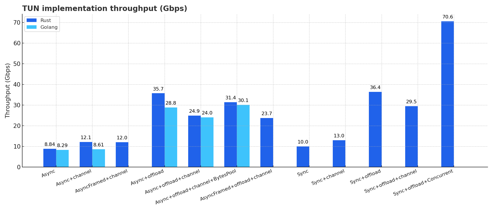
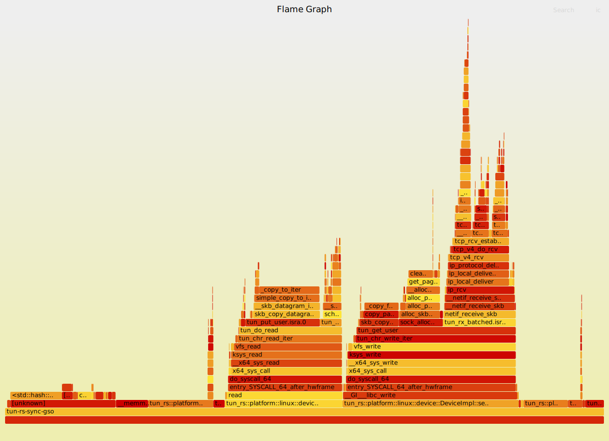

# TUN Benchmark Tool

This is a benchmarking tool for measuring the performance of TUN interface implementations on Linux using different
configurations and libraries.

## Environment

- **OS:** Ubuntu 20.04.6 LTS(6.14.0-24-generic)
- **CPU:** i7-13700K
- **Memory:** DDR5 32GB（2×16GB, 4800 MT/s）
- **Benchmark Tool:** iperf3
- **Baseline Performance (Loopback via TUN IP):** ~110 Gbps
- **TUN Libraries:** [`tun-rs 2.5.1`](https://github.com/tun-rs/tun-rs)

## Test

Each test uses `iperf3` to send traffic from `10.0.1.1` (via `tun11`) to `10.0.2.1` (via `tun22`). All interfaces are
handled using a Rust-based TUN forwarder, either in async or sync mode, with optional channel buffering and offload.

```shell
 # Test all test cases
 ./scripts/bench.sh
 # Run the specified test case with parameters
 ./scripts/bench.sh "./target/release/tun-rs-async-gso-channel --thread 2"
```

## Benchmark Summary Table

| #   | Mode                                                | Offload | Channel | Gbps | Retr | CPU Avg | CPU Max | Mem Avg | Mem Max |
|-----|-----------------------------------------------------|---------|---------|------|------|---------|---------|---------|---------|
| 1   | Async                                               | ❌       | ❌       | 8.84 | 326  | 87.61   | 131.00  | 3.71    | 3.71    |
| 2   | Async                                               | ❌       | ✅       | 12.1 | 3513 | 126.87  | 190.00  | 10.04   | 11.44   |
| 3   | AsyncFramed                                         | ❌       | ✅       | 12.0 | 3967 | 126.89  | 190.00  | 11.47   | 14.60   |
| 4   | Async                                               | ✅       | ❌       | 35.7 | 0    | 64.89   | 97.70   | 7.44    | 7.44    |
| 5   | Async                                               | ✅       | ✅       | 20.7 | 0    | 87.65   | 131.00  | 293.40  | 329.55  |
| 6   | AsyncFramed                                         | ✅       | ✅       | 23.7 | 0    | 88.46   | 132.00  | 26.27   | 28.92   |
| 7   | Sync                                                | ❌       | ❌       | 10.0 | 804  | 79.74   | 119.00  | 2.21    | 2.21    |
| 8   | Sync                                                | ❌       | ✅       | 13.0 | 5585 | 136.90  | 205.00  | 3.97    | 4.23    |
| 9   | Sync                                                | ✅       | ❌       | 36.4 | 0    | 57.90   | 86.90   | 6.80    | 6.80    |
| 10  | Sync                                                | ✅       | ✅       | 33.7 | 0    | 95.27   | 143.00  | 111.30  | 140.10  |
| 11* | Sync (Concurrent)                                   | ✅       | ❌       | 70.6 | 2748 | 124.49  | 185.00  | 10.65   | 10.65   |
| 12  | [Go Basic](https://github.com/tun-rs/go_tun_test)   | ❌       | ❌       | 8.29 | 541  | 84.95   | 127.00  | 2.46    | 2.46    |
| 13  | [Go Offload](https://github.com/tun-rs/go_tun_test) | ✅       | ❌       | 28.8 | 0    | 64.14   | 96.20   | 4.15    | 4.15    |

\* Test 11 uses dual-threaded concurrent I/O with GSO enabled (no channel), yielding peak throughput.

- **Channel**: Channel buffering
- **Gbps**: Bitrate
- **Retr**: Retransmissions
- **CPU Avg/Max**: usage in %
- **Mem Avg/Max**: usage in MB



### 1. Basic TUN Read/Write (Async)

```text
Connecting to host 10.0.2.1, port 5201
[  5] local 10.0.1.1 port 39800 connected to 10.0.2.1 port 5201
[ ID] Interval           Transfer     Bitrate         Retr  Cwnd                                                                                                                                                                                                                                                                                                                                                                                                           
[  5]   0.00-10.01  sec  10.3 GBytes  8.84 Gbits/sec  326    626 KBytes                                                                                                                                                                                                                                                                                                                                                                                                    
- - - - - - - - - - - - - - - - - - - - - - - - -                                                                                                                                                                                                                                                                                                                                                                                                                          
[ ID] Interval           Transfer     Bitrate         Retr                                                                                                                                                                                                                                                                                                                                                                                                                 
[  5]   0.00-10.01  sec  10.3 GBytes  8.84 Gbits/sec  326             sender                                                                                                                                                                                                                                                                                                                                                                                               
[  5]   0.00-10.01  sec  10.3 GBytes  8.84 Gbits/sec                  receiver                                                                                                                                                                                                                                                                                                                                                                                             
                                                                                                                                                                                                                                                                                                                                                                                                                                                                           
iperf Done.                                                                                                                                                                                                                                                                                                                                                                                                                                                                
=== Monitor Summary ===
Avg CPU:    87.61 %
Max CPU:    131.00 %
Avg Memory: 3.71 MB
Max Memory: 3.71 MB
```


### 2. Basic TUN with Channel Buffering (Async)

```text
Connecting to host 10.0.2.1, port 5201
[  5] local 10.0.1.1 port 51256 connected to 10.0.2.1 port 5201                                                                                                                                                                                                                                                                                                                                                                                                            
[ ID] Interval           Transfer     Bitrate         Retr  Cwnd                                                                                                                                                                                                                                                                                                                                                                                                           
[  5]   0.00-10.01  sec  14.1 GBytes  12.1 Gbits/sec  3513   2.00 MBytes                                                                                                                                                                                                                                                                                                                                                                                                   
- - - - - - - - - - - - - - - - - - - - - - - - -                                                                                                                                                                                                                                                                                                                                                                                                                          
[ ID] Interval           Transfer     Bitrate         Retr                                                                                                                                                                                                                                                                                                                                                                                                                 
[  5]   0.00-10.01  sec  14.1 GBytes  12.1 Gbits/sec  3513             sender                                                                                                                                                                                                                                                                                                                                                                                              
[  5]   0.00-10.01  sec  14.1 GBytes  12.1 Gbits/sec                  receiver                                                                                                                                                                                                                                                                                                                                                                                             
                                                                                                                                                                                                                                                                                                                                                                                                                                                                           
iperf Done.                                                                                                                                                                                                                                                                                                                                                                                                                                                                
=== Monitor Summary ===
Avg CPU:    126.87 %
Max CPU:    190.00 %
Avg Memory: 10.04 MB
Max Memory: 11.44 MB
```


### 3. DeviceFramed (Async)

```text
Connecting to host 10.0.2.1, port 5201
[  5] local 10.0.1.1 port 33882 connected to 10.0.2.1 port 5201                                                                                                                                                                                                                                                                                                                                                                                                            
[ ID] Interval           Transfer     Bitrate         Retr  Cwnd                                                                                                                                                                                                                                                                                                                                                                                                           
[  5]   0.00-10.01  sec  14.0 GBytes  12.0 Gbits/sec  3967   1.62 MBytes                                                                                                                                                                                                                                                                                                                                                                                                   
- - - - - - - - - - - - - - - - - - - - - - - - -                                                                                                                                                                                                                                                                                                                                                                                                                          
[ ID] Interval           Transfer     Bitrate         Retr                                                                                                                                                                                                                                                                                                                                                                                                                 
[  5]   0.00-10.01  sec  14.0 GBytes  12.0 Gbits/sec  3967             sender                                                                                                                                                                                                                                                                                                                                                                                              
[  5]   0.00-10.01  sec  14.0 GBytes  12.0 Gbits/sec                  receiver                                                                                                                                                                                                                                                                                                                                                                                             
                                                                                                                                                                                                                                                                                                                                                                                                                                                                           
iperf Done.                                                                                                                                                                                                                                                                                                                                                                                                                                                                
=== Monitor Summary ===
Avg CPU:    126.89 %
Max CPU:    190.00 %
Avg Memory: 11.47 MB
Max Memory: 14.60 MB
```


### 4. TUN with Offload Enabled (Async)

```text
Connecting to host 10.0.2.1, port 5201
[  5] local 10.0.1.1 port 36108 connected to 10.0.2.1 port 5201                                                                                                                                                                                                                                                                                                                                                                                                            
[ ID] Interval           Transfer     Bitrate         Retr  Cwnd                                                                                                                                                                                                                                                                                                                                                                                                           
[  5]   0.00-10.01  sec  41.6 GBytes  35.7 Gbits/sec    0   4.17 MBytes                                                                                                                                                                                                                                                                                                                                                                                                    
- - - - - - - - - - - - - - - - - - - - - - - - -                                                                                                                                                                                                                                                                                                                                                                                                                          
[ ID] Interval           Transfer     Bitrate         Retr                                                                                                                                                                                                                                                                                                                                                                                                                 
[  5]   0.00-10.01  sec  41.6 GBytes  35.7 Gbits/sec    0             sender                                                                                                                                                                                                                                                                                                                                                                                               
[  5]   0.00-10.01  sec  41.6 GBytes  35.7 Gbits/sec                  receiver                                                                                                                                                                                                                                                                                                                                                                                             
                                                                                                                                                                                                                                                                                                                                                                                                                                                                           
iperf Done.                                                                                                                                                                                                                                                                                                                                                                                                                                                                
=== Monitor Summary ===
Avg CPU:    64.89 %
Max CPU:    97.70 %
Avg Memory: 7.44 MB
Max Memory: 7.44 MB
```


### 5. TUN with Offload + Channel Buffering (Async)

```text
Connecting to host 10.0.2.1, port 5201
[  5] local 10.0.1.1 port 41218 connected to 10.0.2.1 port 5201                                                                                                                                                                                                                                                                                                                                                                                                            
[ ID] Interval           Transfer     Bitrate         Retr  Cwnd                                                                                                                                                                                                                                                                                                                                                                                                           
[  5]   0.00-10.01  sec  24.1 GBytes  20.7 Gbits/sec    0   4.11 MBytes                                                                                                                                                                                                                                                                                                                                                                                                    
- - - - - - - - - - - - - - - - - - - - - - - - -                                                                                                                                                                                                                                                                                                                                                                                                                          
[ ID] Interval           Transfer     Bitrate         Retr                                                                                                                                                                                                                                                                                                                                                                                                                 
[  5]   0.00-10.01  sec  24.1 GBytes  20.7 Gbits/sec    0             sender                                                                                                                                                                                                                                                                                                                                                                                               
[  5]   0.00-10.01  sec  24.1 GBytes  20.7 Gbits/sec                  receiver                                                                                                                                                                                                                                                                                                                                                                                             
                                                                                                                                                                                                                                                                                                                                                                                                                                                                           
iperf Done.                                                                                                                                                                                                                                                                                                                                                                                                                                                                
=== Monitor Summary ===
Avg CPU:    87.65 %
Max CPU:    131.00 %
Avg Memory: 293.40 MB
Max Memory: 329.55 MB
```


### 6. TUN with Offload + DeviceFramed (Async)

```text
Connecting to host 10.0.2.1, port 5201
[  5] local 10.0.1.1 port 40948 connected to 10.0.2.1 port 5201                                                                                                                                                                                                                                                                                                                                                                                                            
[ ID] Interval           Transfer     Bitrate         Retr  Cwnd                                                                                                                                                                                                                                                                                                                                                                                                           
[  5]   0.00-10.01  sec  27.6 GBytes  23.7 Gbits/sec    0   4.13 MBytes                                                                                                                                                                                                                                                                                                                                                                                                    
- - - - - - - - - - - - - - - - - - - - - - - - -                                                                                                                                                                                                                                                                                                                                                                                                                          
[ ID] Interval           Transfer     Bitrate         Retr                                                                                                                                                                                                                                                                                                                                                                                                                 
[  5]   0.00-10.01  sec  27.6 GBytes  23.7 Gbits/sec    0             sender                                                                                                                                                                                                                                                                                                                                                                                               
[  5]   0.00-10.01  sec  27.6 GBytes  23.7 Gbits/sec                  receiver                                                                                                                                                                                                                                                                                                                                                                                             
                                                                                                                                                                                                                                                                                                                                                                                                                                                                           
iperf Done.                                                                                                                                                                                                                                                                                                                                                                                                                                                                
=== Monitor Summary ===
Avg CPU:    88.46 %
Max CPU:    132.00 %
Avg Memory: 26.27 MB
Max Memory: 28.92 MB
```


### 7. Basic TUN Read/Write (Sync)

```text
Connecting to host 10.0.2.1, port 5201
[  5] local 10.0.1.1 port 40824 connected to 10.0.2.1 port 5201                                                                                                                                                                                                                                                                                                                                                                                                            
[ ID] Interval           Transfer     Bitrate         Retr  Cwnd                                                                                                                                                                                                                                                                                                                                                                                                           
[  5]   0.00-10.01  sec  11.7 GBytes  10.0 Gbits/sec  804    491 KBytes                                                                                                                                                                                                                                                                                                                                                                                                    
- - - - - - - - - - - - - - - - - - - - - - - - -                                                                                                                                                                                                                                                                                                                                                                                                                          
[ ID] Interval           Transfer     Bitrate         Retr                                                                                                                                                                                                                                                                                                                                                                                                                 
[  5]   0.00-10.01  sec  11.7 GBytes  10.0 Gbits/sec  804             sender                                                                                                                                                                                                                                                                                                                                                                                               
[  5]   0.00-10.01  sec  11.7 GBytes  10.0 Gbits/sec                  receiver                                                                                                                                                                                                                                                                                                                                                                                             
                                                                                                                                                                                                                                                                                                                                                                                                                                                                           
iperf Done.                                                                                                                                                                                                                                                                                                                                                                                                                                                                
=== Monitor Summary ===
Avg CPU:    79.74 %
Max CPU:    119.00 %
Avg Memory: 2.21 MB
Max Memory: 2.21 MB
```


### 8. Basic TUN with Channel Buffering (Sync)

```text
Connecting to host 10.0.2.1, port 5201
[  5] local 10.0.1.1 port 54696 connected to 10.0.2.1 port 5201                                                                                                                                                                                                                                                                                                                                                                                                            
[ ID] Interval           Transfer     Bitrate         Retr  Cwnd                                                                                                                                                                                                                                                                                                                                                                                                           
[  5]   0.00-10.01  sec  15.2 GBytes  13.0 Gbits/sec  5585   1.13 MBytes                                                                                                                                                                                                                                                                                                                                                                                                   
- - - - - - - - - - - - - - - - - - - - - - - - -                                                                                                                                                                                                                                                                                                                                                                                                                          
[ ID] Interval           Transfer     Bitrate         Retr                                                                                                                                                                                                                                                                                                                                                                                                                 
[  5]   0.00-10.01  sec  15.2 GBytes  13.0 Gbits/sec  5585             sender                                                                                                                                                                                                                                                                                                                                                                                              
[  5]   0.00-10.01  sec  15.2 GBytes  13.0 Gbits/sec                  receiver                                                                                                                                                                                                                                                                                                                                                                                             
                                                                                                                                                                                                                                                                                                                                                                                                                                                                           
iperf Done.                                                                                                                                                                                                                                                                                                                                                                                                                                                                
=== Monitor Summary ===
Avg CPU:    136.90 %
Max CPU:    205.00 %
Avg Memory: 3.97 MB
Max Memory: 4.23 MB
```


### 9. TUN with Offload Enabled (Sync)

```text
Connecting to host 10.0.2.1, port 5201
[  5] local 10.0.1.1 port 36196 connected to 10.0.2.1 port 5201                                                                                                                                                                                                                                                                                                                                                                                                            
[ ID] Interval           Transfer     Bitrate         Retr  Cwnd                                                                                                                                                                                                                                                                                                                                                                                                           
[  5]   0.00-10.01  sec  42.4 GBytes  36.4 Gbits/sec    0   4.07 MBytes                                                                                                                                                                                                                                                                                                                                                                                                    
- - - - - - - - - - - - - - - - - - - - - - - - -                                                                                                                                                                                                                                                                                                                                                                                                                          
[ ID] Interval           Transfer     Bitrate         Retr                                                                                                                                                                                                                                                                                                                                                                                                                 
[  5]   0.00-10.01  sec  42.4 GBytes  36.4 Gbits/sec    0             sender                                                                                                                                                                                                                                                                                                                                                                                               
[  5]   0.00-10.01  sec  42.4 GBytes  36.4 Gbits/sec                  receiver                                                                                                                                                                                                                                                                                                                                                                                             
                                                                                                                                                                                                                                                                                                                                                                                                                                                                           
iperf Done.                                                                                                                                                                                                                                                                                                                                                                                                                                                                
=== Monitor Summary ===
Avg CPU:    57.90 %
Max CPU:    86.90 %
Avg Memory: 6.80 MB
Max Memory: 6.80 MB
```



### 10. TUN with Offload + Channel Buffering (Sync)

```text
Connecting to host 10.0.2.1, port 5201
[  5] local 10.0.1.1 port 38892 connected to 10.0.2.1 port 5201                                                                                                                                                                                                                                                                                                                                                                                                            
[ ID] Interval           Transfer     Bitrate         Retr  Cwnd                                                                                                                                                                                                                                                                                                                                                                                                           
[  5]   0.00-10.01  sec  39.2 GBytes  33.7 Gbits/sec    0   4.17 MBytes                                                                                                                                                                                                                                                                                                                                                                                                    
- - - - - - - - - - - - - - - - - - - - - - - - -                                                                                                                                                                                                                                                                                                                                                                                                                          
[ ID] Interval           Transfer     Bitrate         Retr                                                                                                                                                                                                                                                                                                                                                                                                                 
[  5]   0.00-10.01  sec  39.2 GBytes  33.7 Gbits/sec    0             sender                                                                                                                                                                                                                                                                                                                                                                                               
[  5]   0.00-10.01  sec  39.2 GBytes  33.7 Gbits/sec                  receiver                                                                                                                                                                                                                                                                                                                                                                                             
                                                                                                                                                                                                                                                                                                                                                                                                                                                                           
iperf Done.                                                                                                                                                                                                                                                                                                                                                                                                                                                                
=== Monitor Summary ===
Avg CPU:    95.27 %
Max CPU:    143.00 %
Avg Memory: 111.30 MB
Max Memory: 140.10 MB
```


### 11. TUN with Offload + Dual-Threaded Concurrent I/O (Sync)

```text
Connecting to host 10.0.2.1, port 5201
[  5] local 10.0.1.1 port 35190 connected to 10.0.2.1 port 5201                                                                                                                                                                                                                                                                                                                                                                                                            
[ ID] Interval           Transfer     Bitrate         Retr  Cwnd                                                                                                                                                                                                                                                                                                                                                                                                           
[  5]   0.00-10.01  sec  82.3 GBytes  70.6 Gbits/sec  2748   3.98 MBytes                                                                                                                                                                                                                                                                                                                                                                                                   
- - - - - - - - - - - - - - - - - - - - - - - - -                                                                                                                                                                                                                                                                                                                                                                                                                          
[ ID] Interval           Transfer     Bitrate         Retr                                                                                                                                                                                                                                                                                                                                                                                                                 
[  5]   0.00-10.01  sec  82.3 GBytes  70.6 Gbits/sec  2748             sender                                                                                                                                                                                                                                                                                                                                                                                              
[  5]   0.00-10.01  sec  82.3 GBytes  70.6 Gbits/sec                  receiver                                                                                                                                                                                                                                                                                                                                                                                             
                                                                                                                                                                                                                                                                                                                                                                                                                                                                           
iperf Done.                                                                                                                                                                                                                                                                                                                                                                                                                                                                
=== Monitor Summary ===
Avg CPU:    124.49 %
Max CPU:    185.00 %
Avg Memory: 10.65 MB
Max Memory: 10.65 MB
```


### 12. Go TUN Implementation: Basic Read/Write (No Offload)

https://github.com/tun-rs/go_tun_test

```text
Connecting to host 10.0.2.1, port 5201
[  5] local 10.0.1.1 port 58348 connected to 10.0.2.1 port 5201                                                                                                                                                                                                                                                                                                                                                                                                            
[ ID] Interval           Transfer     Bitrate         Retr  Cwnd                                                                                                                                                                                                                                                                                                                                                                                                           
[  5]   0.00-10.00  sec  9.65 GBytes  8.29 Gbits/sec  541    505 KBytes                                                                                                                                                                                                                                                                                                                                                                                                    
- - - - - - - - - - - - - - - - - - - - - - - - -                                                                                                                                                                                                                                                                                                                                                                                                                          
[ ID] Interval           Transfer     Bitrate         Retr                                                                                                                                                                                                                                                                                                                                                                                                                 
[  5]   0.00-10.00  sec  9.65 GBytes  8.29 Gbits/sec  541             sender                                                                                                                                                                                                                                                                                                                                                                                               
[  5]   0.00-10.00  sec  9.65 GBytes  8.29 Gbits/sec                  receiver                                                                                                                                                                                                                                                                                                                                                                                             
                                                                                                                                                                                                                                                                                                                                                                                                                                                                           
iperf Done.                                                                                                                                                                                                                                                                                                                                                                                                                                                                
=== Monitor Summary ===
Avg CPU:    84.95 %
Max CPU:    127.00 %
Avg Memory: 2.46 MB
Max Memory: 2.46 MB
```


### 13. Go TUN Implementation: With Offload (GSO/GRO Enabled)

https://github.com/tun-rs/go_tun_test

```text
Connecting to host 10.0.2.1, port 5201
[  5] local 10.0.1.1 port 57976 connected to 10.0.2.1 port 5201                                                                                                                                                                                                                                                                                                                                                                                                            
[ ID] Interval           Transfer     Bitrate         Retr  Cwnd                                                                                                                                                                                                                                                                                                                                                                                                           
[  5]   0.00-10.01  sec  33.6 GBytes  28.8 Gbits/sec    0   4.14 MBytes                                                                                                                                                                                                                                                                                                                                                                                                    
- - - - - - - - - - - - - - - - - - - - - - - - -                                                                                                                                                                                                                                                                                                                                                                                                                          
[ ID] Interval           Transfer     Bitrate         Retr                                                                                                                                                                                                                                                                                                                                                                                                                 
[  5]   0.00-10.01  sec  33.6 GBytes  28.8 Gbits/sec    0             sender                                                                                                                                                                                                                                                                                                                                                                                               
[  5]   0.00-10.01  sec  33.6 GBytes  28.8 Gbits/sec                  receiver                                                                                                                                                                                                                                                                                                                                                                                             
                                                                                                                                                                                                                                                                                                                                                                                                                                                                           
iperf Done.                                                                                                                                                                                                                                                                                                                                                                                                                                                                
=== Monitor Summary ===
Avg CPU:    64.14 %
Max CPU:    96.20 %
Avg Memory: 4.15 MB
Max Memory: 4.15 MB
```


